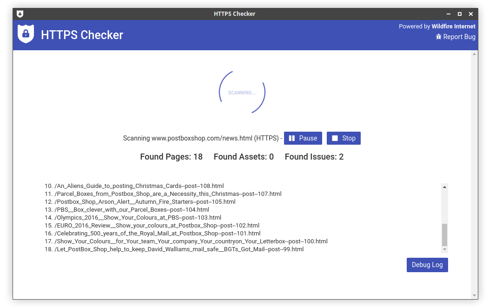

# HTTPS Checker

[HTTPS Checker](https://httpschecker.net/guides/https-checker) is a cross platform Desktop app to crawl over a website and find **mixed content** issues. Useful when migrating a website to HTTPS. 

Supports modern 64bit versions of **Mac**, **Windows** & **Linux**.

Find out more and download from here: [https://httpschecker.net/](https://httpschecker.net/)

This repo is for HTTPS Checker [release downloads](./releases) and submitting [issues](./issues).

### Check out our [Wiki](https://github.com/HTTPSChecker/releases/wiki) for usage information.
